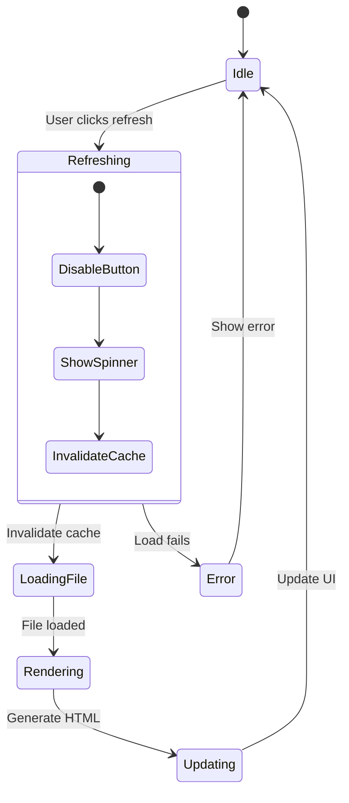
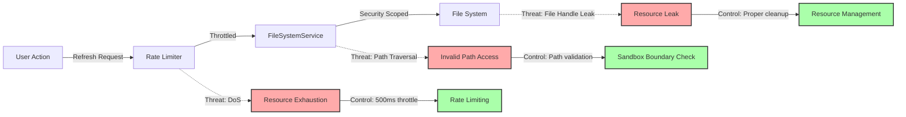

# Refresh Button for Preview Design Document

## Overview
This feature adds a manual refresh button to the preview toolbar, addressing the issue where file changes made by external applications may show cached content instead of the current disk state. The refresh button provides users with explicit control over when content is reloaded, ensuring they always have access to the latest version of their documents while maintaining the performance benefits of caching.

## Technical Architecture

### Component Architecture
```mermaid
flowchart TD
    A[FilePreviewView] -->|contains| B[Toolbar]
    B -->|contains| C[RefreshButton]
    C -->|triggers| D[MarkdownViewModel.refreshContent]
    D -->|calls| E[MarkdownDocument.reloadFromDisk]
    E -->|uses| F[FileSystemService]
    F -->|reads| G[File System]
    
    D -->|invalidates| H[RenderCache]
    D -->|updates| I[@Published renderedHTML]
    I -->|refreshes| J[MarkdownPreviewView/WKWebView]
    
    K[Cmd+R Shortcut] -->|triggers| C
    
    style C fill:#f9f,stroke:#333,stroke-width:4px
    style D fill:#bbf,stroke:#333,stroke-width:2px
```

### State Management Flow


## Security Architecture

### Threat Model


### Security Controls

#### Sandboxing
- No new entitlements required - operates within existing `com.apple.security.files.user-selected.read-write`
- Uses existing security-scoped bookmarks for file access
- No network access required (local-only operation)

#### File Access
- Path validation before any file operation
- Reuses existing security-scoped bookmark from initial file open
- No new file handles created - reuses existing file monitoring infrastructure
- Proper cleanup of resources in defer blocks

#### Rate Limiting Implementation
```swift
// Prevent rapid refresh attempts
private var lastRefreshTime: Date = .distantPast
private let minimumRefreshInterval: TimeInterval = 0.5 // 500ms

func canRefresh() -> Bool {
    Date().timeIntervalSince(lastRefreshTime) >= minimumRefreshInterval
}
```

#### Resource Management
- File handles properly closed after read operations
- Memory usage monitored during HTML rendering
- Cache size limits enforced (existing 50 document limit)
- Async operations use Task cancellation for cleanup

## Implementation Details

### SwiftUI Components

#### View Hierarchy
```
FilePreviewView
├── VStack
│   ├── HStack (Toolbar)
│   │   ├── File Info (Icon, Name, Status)
│   │   ├── Spacer
│   │   ├── RefreshButton (NEW)
│   │   ├── ExportButton (existing)
│   │   └── EditButton (existing)
│   ├── Divider
│   └── Content Area
│       └── MarkdownPreviewView
```

#### RefreshButton Component
```swift
struct RefreshButton: View {
    @ObservedObject var viewModel: MarkdownViewModel
    @State private var isRotating = false
    
    var body: some View {
        Button(action: refresh) {
            Label("Refresh", systemImage: "arrow.clockwise")
                .rotationEffect(.degrees(isRotating ? 360 : 0))
                .animation(
                    isRotating ? .linear(duration: 1).repeatForever(autoreverses: false) : .default,
                    value: isRotating
                )
        }
        .keyboardShortcut("r", modifiers: .command)
        .disabled(!viewModel.canRefresh() || viewModel.isLoading)
        .help("Reload file from disk (⌘R)")
    }
    
    private func refresh() {
        Task {
            isRotating = true
            await viewModel.refreshContent()
            isRotating = false
        }
    }
}
```

### File System Integration

#### Enhanced MarkdownViewModel
```swift
extension MarkdownViewModel {
    /// Refreshes the current document from disk
    @MainActor
    func refreshContent() async {
        guard let document = currentDocument,
              canRefresh() else { return }
        
        lastRefreshTime = Date()
        
        // Invalidate cache for this document
        invalidateCache(for: document.url)
        
        // Show loading state
        isLoading = true
        
        // Reload from disk
        await document.reloadFromDisk()
        
        // Re-render the document
        await renderDocument(document)
        
        isLoading = false
        
        // Post notification for UI updates
        NotificationCenter.default.post(
            name: .documentRefreshed,
            object: nil,
            userInfo: ["url": document.url]
        )
    }
    
    func canRefresh() -> Bool {
        guard !isLoading else { return false }
        return Date().timeIntervalSince(lastRefreshTime) >= minimumRefreshInterval
    }
}
```

### Markdown Rendering Pipeline

1. User clicks refresh button or presses Cmd+R
2. Rate limiter checks if refresh is allowed
3. Cache entry for current document is invalidated
4. File content is reloaded using existing `reloadFromDisk()` method
5. FSEvents monitoring temporarily paused to prevent duplicate refreshes
6. Content is re-parsed and rendered to HTML
7. WKWebView is updated with new content
8. Scroll position is preserved when possible

### Performance Optimizations

- **Debouncing**: 500ms minimum interval between refreshes
- **Async Operations**: All file I/O performed asynchronously
- **Cache Invalidation**: Only the current document's cache is cleared
- **Lazy Rendering**: HTML generation only occurs after successful file load
- **Animation Performance**: Rotation animation uses Core Animation for efficiency

## Privacy Considerations

- **Local-only operation**: No network requests or telemetry
- **No new data storage**: Uses existing UserDefaults for preferences
- **File access limited**: Only refreshes already-opened files
- **No analytics**: No usage tracking or metrics collection

## Security Testing Strategy

### Static Analysis (SAST)
- SwiftLint with security rules for proper resource management
- Xcode Static Analyzer for memory leaks and retain cycles
- Manual code review for path validation logic

### Dynamic Testing (DAST)
```swift
// Test rapid refresh attempts
func testRateLimiting() {
    for _ in 0..<10 {
        viewModel.refreshContent()
    }
    // Verify only one refresh executed
}

// Test resource cleanup
func testFileHandleCleanup() {
    // Monitor file handle count before/after refresh
    let initialHandles = getOpenFileHandles()
    await viewModel.refreshContent()
    let finalHandles = getOpenFileHandles()
    XCTAssertEqual(initialHandles, finalHandles)
}
```

### Security Test Cases
- Rapid refresh attempts (DoS prevention)
- File handle exhaustion tests
- Memory usage during large file refreshes
- Concurrent refresh and edit operations
- Refresh during file deletion/move

## UI/UX Considerations

Following Apple Human Interface Guidelines:

### Visual Design
- Standard macOS toolbar button styling
- System symbol "arrow.clockwise" for refresh
- Subtle rotation animation during refresh
- Disabled state when refresh not available

### Keyboard Support
- Cmd+R shortcut (standard macOS refresh)
- Full keyboard navigation support
- VoiceOver announces refresh status

### Feedback
- Visual: Button rotation animation
- Accessibility: VoiceOver announcements
- Error handling: Toast notifications for failures

### Placement
- Positioned before Export and Edit buttons
- Consistent spacing with other toolbar items
- Secondary button style (not prominent)

## Error Handling Strategy

```swift
enum RefreshError: LocalizedError {
    case fileNotFound
    case accessDenied
    case rateLimitExceeded
    
    var errorDescription: String? {
        switch self {
        case .fileNotFound:
            return "File no longer exists at this location"
        case .accessDenied:
            return "Permission denied. Please reopen the file."
        case .rateLimitExceeded:
            return "Please wait before refreshing again"
        }
    }
}
```

## Performance Requirements

- **Refresh Time**: < 100ms for files under 1MB
- **Animation**: 60fps rotation animation
- **Memory**: No increase in baseline memory usage
- **CPU**: < 5% CPU usage during refresh

## Rollout Plan

### Phase 1: Core Implementation
- Add refresh button to toolbar
- Implement basic refresh functionality
- Add keyboard shortcut

### Phase 2: Polish
- Add rotation animation
- Implement rate limiting
- Add error handling

### Phase 3: Testing
- Security review
- Performance testing
- Accessibility testing

### Security Review Gates
- Code review by security specialist before merge
- Static analysis must pass with no high/critical findings
- Dynamic security tests must pass
- No new entitlements added