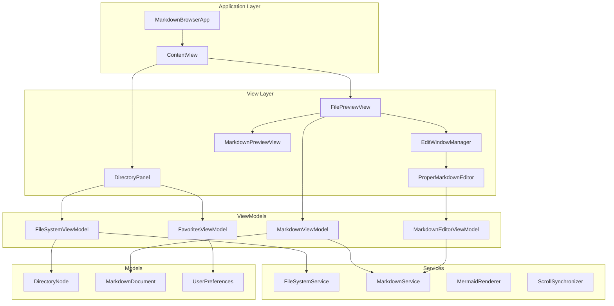
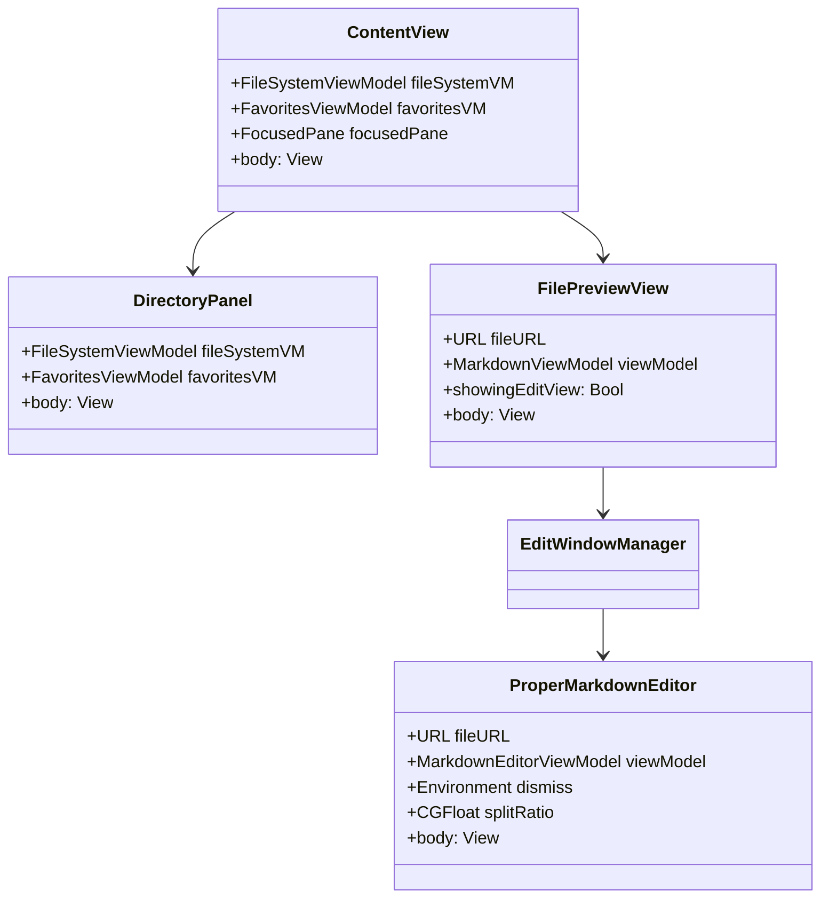
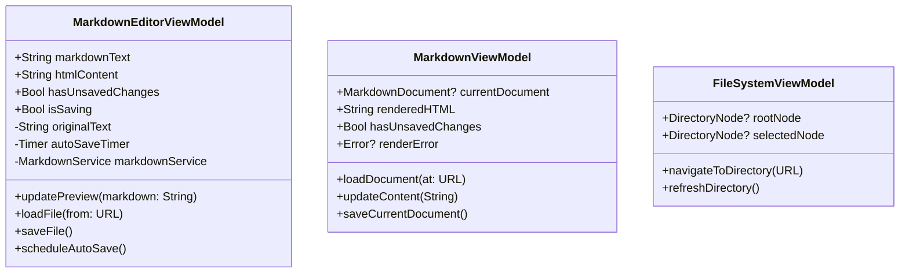
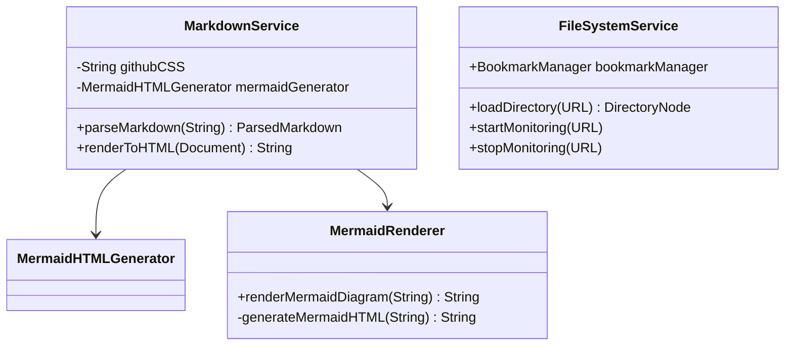
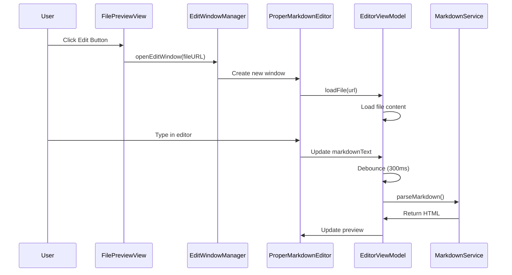
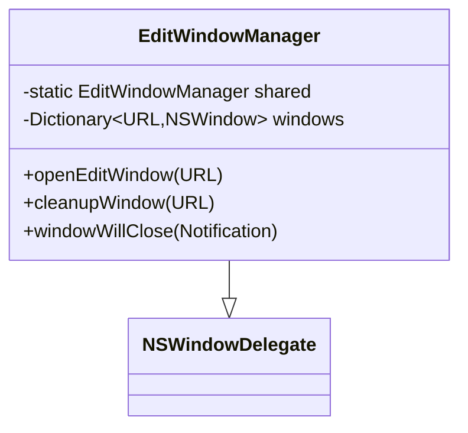
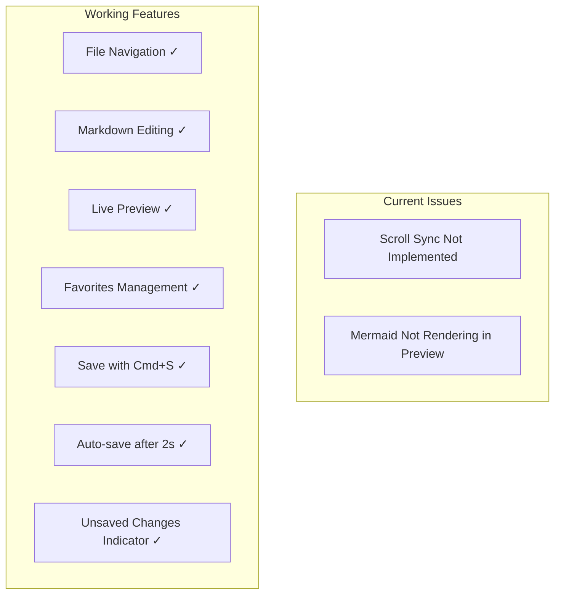
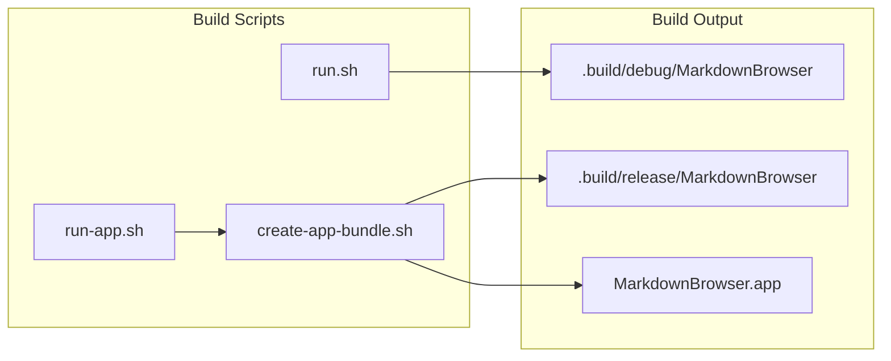

# Current Architecture

## Overview

MarkdownBrowser is a macOS application built with SwiftUI that provides a dual-pane interface for browsing and editing Markdown files. The application follows MVVM architecture patterns and uses a combination of SwiftUI and AppKit components.

## High-Level Architecture



## Component Details

### Views



### ViewModels



### Services



## Data Flow

### Edit Mode Flow



### Window Management



### Notification System

The app uses NotificationCenter for cross-component communication:
- `markdownFileSaved`: Posted when a file is saved in the editor
  - Contains URL in userInfo dictionary
  - FilePreviewView listens to reload content

### Keyboard Shortcuts

The app implements Cmd+S using SwiftUI's FocusedValue system:
- `SaveActionKey`: Custom FocusedValueKey for save action
- Main app adds File > Save menu item
- ProperMarkdownEditor provides save action via `.focusedSceneValue`

### Known Issues



## Technology Stack

- **UI Framework**: SwiftUI
- **Text Editing**: NSTextView (AppKit)
- **Web Preview**: WKWebView (WebKit)
- **Markdown Parsing**: swift-markdown (Apple)
- **Reactive Programming**: Combine
- **Concurrency**: Swift async/await
- **File System**: FSEvents API

## Build System



## App Bundle Structure

```
MarkdownBrowser.app/
├── Contents/
│   ├── MacOS/
│   │   └── MarkdownBrowser (executable)
│   ├── Resources/
│   └── Info.plist
```

## Key Architectural Decisions

1. **Separate Windows for Editing**: Edit mode opens in a new window managed by `EditWindowManager`
2. **MVVM Pattern**: Clear separation between Views and ViewModels
3. **Debounced Preview Updates**: 300ms delay prevents excessive rendering
4. **App Bundle for Keyboard Focus**: Proper macOS app bundle ensures keyboard input works correctly
5. **NSViewRepresentable for Text Editing**: Wraps NSTextView for better text editing capabilities than SwiftUI's TextEditor