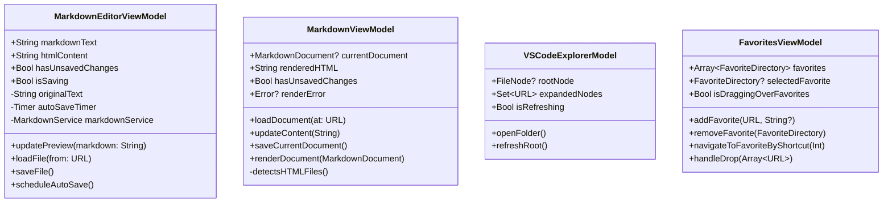

# Current Architecture

## Overview

MarkdownBrowser is a macOS application built with SwiftUI that provides a dual-pane interface for browsing and editing Markdown files. The application follows MVVM architecture patterns and uses a combination of SwiftUI and AppKit components.

## High-Level Architecture


## Component Details

### Views


### ViewModels



### Services


## Data Flow

### Edit Mode Flow


### Window Management


### Notification System

The app uses NotificationCenter for cross-component communication:
- `markdownFileSaved`: Posted when a file is saved in the editor
  - Contains URL in userInfo dictionary
  - FilePreviewView listens to reload content

### Keyboard Shortcuts

The app implements several keyboard shortcuts:
- **Cmd+S**: Save using SwiftUI's FocusedValue system
  - `SaveActionKey`: Custom FocusedValueKey for save action
  - Main app adds File > Save menu item
  - ProperMarkdownEditor provides save action via `.focusedSceneValue`
- **Cmd+1 to Cmd+9**: Quick navigation to favorited directories
  - Implemented using `.keyboardShortcut` modifier
  - FavoritesViewModel manages shortcut assignments
- **Cmd+Shift+.**: Toggle hidden files visibility
  - Added to View menu in MarkdownBrowserApp
  - Toggles UserPreferences.showHiddenFiles
  - Triggers automatic file tree refresh

### Known Issues


## File Type Support

The application now supports multiple document types through a unified type system:


### Supported Document Types
- **Markdown**: `.md`, `.markdown` - Parsed and rendered with GitHub-style CSS
- **HTML**: `.html`, `.htm` - Rendered directly in WKWebView
- **CSV**: `.csv`, `.tsv` - Parsed and displayed as tables with syntax highlighting

## Technology Stack

- **UI Framework**: SwiftUI
- **Text Editing**: NSTextView (AppKit)
- **Web Preview**: WKWebView (WebKit)
- **Markdown Parsing**: swift-markdown (Apple)
- **HTML Rendering**: Direct WKWebView display
- **Reactive Programming**: Combine
- **Concurrency**: Swift async/await
- **File System**: FSEvents API

## Build System


## App Bundle Structure

```
MarkdownBrowser.app/
├── Contents/
│   ├── MacOS/
│   │   └── MarkdownBrowser (executable)
│   ├── Resources/
│   └── Info.plist
```

## VSCode-Style Explorer

The application uses a VSCode-inspired file explorer interface:


### Favorites System Architecture


## Key Architectural Decisions

1. **VSCode-Style Interface**: Familiar developer interface with favorites section
2. **Separate Windows for Editing**: Edit mode opens in a new window managed by `EditWindowManager`
3. **MVVM Pattern**: Clear separation between Views and ViewModels
4. **Debounced Preview Updates**: 300ms delay prevents excessive rendering
5. **App Bundle for Keyboard Focus**: Proper macOS app bundle ensures keyboard input works correctly
6. **NSViewRepresentable for Text Editing**: Wraps NSTextView for better text editing capabilities than SwiftUI's TextEditor
7. **Security-Scoped Bookmarks**: Favorites use bookmarks for persistent access in sandboxed environment
8. **Dynamic File Enumeration**: FileManager enumeration options controlled by UserPreferences.showHiddenFiles
   - All file loading methods respect the preference
   - Automatic tree refresh on preference change via @ObservedObject