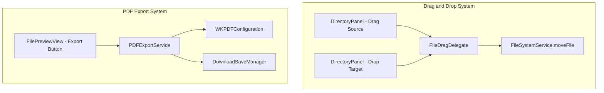
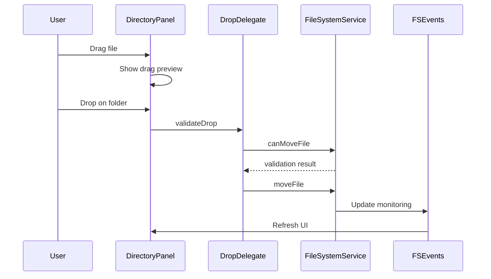
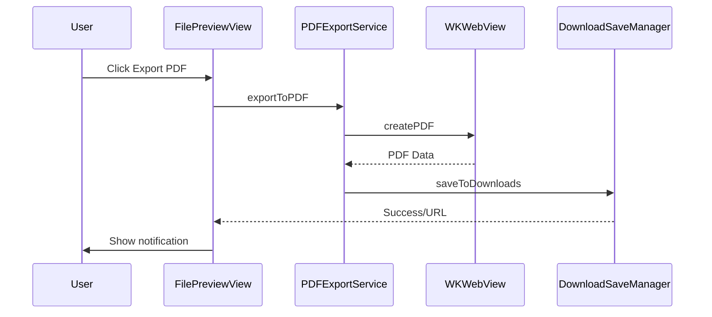

# Technical Design: File Management Features

## Problem Statement

Users need the ability to reorganize files within the MDBrowser application through drag-and-drop operations and export documents as PDFs for sharing. Current implementation requires users to switch to Finder for file organization and external tools for PDF conversion, disrupting workflow.

## Proposed Architecture

### Component Overview



## Implementation Approach

### 1. Drag-and-Drop File Movement

#### Phase 1: Enable Drag Source
- Add `draggable` modifier to file items in DirectoryPanel
- Implement NSItemProvider for file URLs
- Provide visual feedback during drag with custom preview

#### Phase 2: Enable Drop Target
- Add `onDrop` modifier to directory nodes
- Implement DropDelegate protocol for advanced drop handling
- Validate drop operations (prevent dropping into self/children)

#### Phase 3: File Movement Logic
- Add `moveFile` method to FileSystemService
- Handle security-scoped bookmarks for source and destination
- Update FSEvents monitoring after move
- Implement atomic move operations with error recovery

### 2. PDF Export Functionality

#### Phase 1: Export UI
- Add "Export as PDF" button to FilePreviewView toolbar
- Show progress indicator during export
- Display success/failure notifications

#### Phase 2: PDF Generation
- Create PDFExportService using WKWebView's createPDF API
- Support both Markdown (rendered) and HTML (direct) export
- Configure page size and margins appropriately

#### Phase 3: Save to Downloads
- Use DownloadSaveManager to handle file saving
- Generate appropriate filenames with timestamps
- Handle permission errors gracefully

## API Design

### Drag and Drop APIs

```swift
// DirectoryNodeView extension
extension DirectoryNodeView {
    func configureDragDrop() -> some View {
        self
            .draggable(node.url) // For files
            .onDrop(of: [.fileURL], delegate: DirectoryDropDelegate(node: node))
    }
}

// Drop Delegate
class DirectoryDropDelegate: DropDelegate {
    let targetNode: DirectoryNode
    
    func validateDrop(info: DropInfo) -> Bool
    func performDrop(info: DropInfo) -> Bool
    func dropEntered(info: DropInfo)
    func dropExited(info: DropInfo)
}

// FileSystemService extension
extension FileSystemService {
    func moveFile(from source: URL, to destination: URL) async throws
    func canMoveFile(from source: URL, to destination: URL) -> Bool
}
```

### PDF Export APIs

```swift
// PDFExportService
class PDFExportService {
    func exportToPDF(from webView: WKWebView, filename: String) async throws -> URL
    func exportMarkdownToPDF(document: MarkdownDocument) async throws -> URL
    func exportHTMLToPDF(at url: URL) async throws -> URL
}

// DownloadSaveManager
class DownloadSaveManager {
    func saveToDownloads(data: Data, filename: String) async throws -> URL
    func generateUniqueFilename(base: String, extension: String) -> String
}
```

## Data Flow

### Drag and Drop Flow


### PDF Export Flow


## Error Handling Strategy

### Drag and Drop Errors
- **Permission Denied**: Show alert explaining sandbox restrictions
- **File in Use**: Prevent move, show explanation
- **Circular Reference**: Validate before drop, show visual feedback
- **Network Drive**: Handle slow operations with timeout

### PDF Export Errors
- **Rendering Failure**: Fallback to simple HTML export
- **Downloads Access**: Request permission or show save dialog
- **Large Files**: Show progress, allow cancellation
- **Memory Pressure**: Stream data instead of loading all at once

## Performance Considerations

### Drag and Drop
- **Lazy Loading**: Don't enumerate destination contents until needed
- **Visual Feedback**: Use lightweight preview during drag
- **Batch Operations**: Support multiple file selection (future)
- **Background Processing**: Move files off main thread

### PDF Export
- **Rendering Time**: Show progress for documents > 10 pages
- **Memory Usage**: Use autoreleasepool for large exports
- **Cache Rendered HTML**: Reuse existing WebView when possible
- **Concurrent Exports**: Limit to 2 simultaneous exports

## Testing Strategy

### Unit Tests
- FileSystemService.moveFile with various scenarios
- PDFExportService with different document types
- DropDelegate validation logic
- DownloadSaveManager filename generation

### Integration Tests
- Full drag-drop flow with FSEvents updates
- PDF export with actual WKWebView
- Security-scoped bookmark handling
- Error recovery scenarios

### UI Tests
- Drag gesture recognition
- Drop target highlighting
- Export button availability
- Progress indicator behavior

## Security Considerations

### File Operations
- Always use security-scoped bookmarks
- Validate all file paths before operations
- Prevent access outside allowed directories
- Handle symbolic links safely

### PDF Generation
- Sanitize HTML before rendering
- Limit JavaScript execution in WebView
- Validate output file paths
- Respect user privacy (no external resources)

## Accessibility

### Drag and Drop
- VoiceOver announcements for drag/drop
- Keyboard alternatives for file movement
- Clear focus indicators

### PDF Export
- Accessible button labels
- Progress announcements
- Success/error notifications

## Platform Considerations

### macOS Version Support
- Drag/Drop: macOS 13.0+ (SwiftUI native)
- PDF Export: macOS 11.0+ (WKWebView.createPDF)
- Fallback for older versions if needed

### Apple HIG Compliance
- Standard drag cursors and feedback
- Native progress indicators
- System notifications for completion
- Downloads folder integration