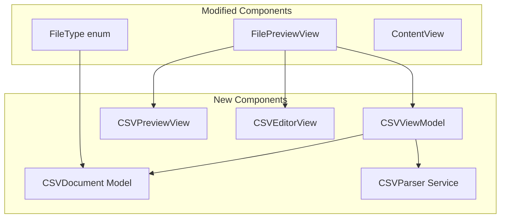

# Software Design Document: CSV Support, Refresh Functionality, Synchronized Scrolling, and Performance Optimization

## Date: 2025-07-22
## Author: Tech Lead
## Version: 1.0

## Executive Summary

This design document addresses four priority enhancements for MarkdownBrowser:
1. **CSV File Support** (Phase 1) - Most requested feature
2. **Refresh Button Fix** (Phase 2) - Critical bug affecting directory refresh  
3. **Synchronized Scrolling** (Phase 3) - Already implemented, needs activation
4. **Directory Loading Performance** (Phase 4) - Scalability improvement

The design prioritizes Phase 1 (CSV support) as it provides the highest user value and expands use cases significantly.

## Phase 1: CSV File Support

### Requirements Analysis

#### Functional Requirements
1. Support CSV file detection and display
2. Provide raw CSV view in editor pane (left side)
3. Render formatted table preview in preview pane (right side)
4. Support common delimiters (comma, tab, semicolon)
5. Enable basic CSV editing with live preview updates
6. Handle large CSV files efficiently (up to 10,000 rows)

#### Non-Functional Requirements
1. CSV parsing must complete in < 200ms for files under 1MB
2. Table rendering must maintain 60fps scrolling performance
3. Memory usage must scale linearly with file size
4. Security: Sanitize CSV content to prevent injection attacks

### Architecture Design

#### Component Architecture



#### Detailed Component Design

##### 1. FileType Extension

```swift
enum FileType: CaseIterable {
    case markdown
    case html
    case csv      // New case
    case directory
    case other
    
    init(from url: URL) {
        // ... existing code ...
        switch ext {
        case "md", "markdown":
            self = .markdown
        case "html", "htm":
            self = .html
        case "csv", "tsv":    // Add CSV support
            self = .csv
        default:
            self = .other
        }
    }
    
    var iconName: String {
        switch self {
        case .csv:
            return "tablecells"   // New SF Symbol for CSV
        // ... existing cases ...
        }
    }
    
    var isSupported: Bool {
        switch self {
        case .markdown, .html, .csv:   // Add CSV to supported types
            return true
        case .directory, .other:
            return false
        }
    }
}
```

##### 2. CSVDocument Model

```swift
class CSVDocument: ObservableObject, Identifiable {
    let id = UUID()
    let url: URL
    let name: String
    
    @Published var rawContent: String = ""
    @Published var parsedData: CSVData?
    @Published var delimiter: CSVDelimiter = .comma
    @Published var hasUnsavedChanges = false
    @Published var isLoading = false
    @Published var error: DocumentError?
    @Published var lastModified: Date?
    
    private var originalContent: String = ""
    private var fileSystemWatcher: DispatchSourceFileSystemObject?
    
    struct CSVData {
        let headers: [String]
        let rows: [[String]]
        let rowCount: Int
        let columnCount: Int
    }
    
    enum CSVDelimiter: String, CaseIterable {
        case comma = ","
        case tab = "\t"
        case semicolon = ";"
        
        var displayName: String {
            switch self {
            case .comma: return "Comma"
            case .tab: return "Tab"
            case .semicolon: return "Semicolon"
            }
        }
    }
    
    // Similar structure to MarkdownDocument
    @MainActor
    func loadContent() async
    
    @MainActor 
    func saveContent() async
    
    func updateContent(_ newContent: String)
    
    func detectDelimiter() -> CSVDelimiter
}
```

##### 3. CSVParser Service

```swift
class CSVParser {
    static let shared = CSVParser()
    
    enum ParseError: Error {
        case invalidFormat
        case emptyFile
        case tooLarge
    }
    
    struct ParseOptions {
        let delimiter: CSVDocument.CSVDelimiter
        let hasHeaders: Bool = true
        let maxRows: Int = 10_000
        let trimWhitespace: Bool = true
    }
    
    func parse(_ content: String, options: ParseOptions) throws -> CSVDocument.CSVData {
        // Efficient streaming parser implementation
        // Handle quoted values, escaped characters
        // Detect headers vs data rows
        // Apply row limit for performance
    }
    
    func detectDelimiter(from content: String) -> CSVDocument.CSVDelimiter {
        // Analyze first few lines to detect most likely delimiter
        // Count occurrences of each delimiter type
        // Consider quoted values
    }
    
    func sanitizeCell(_ value: String) -> String {
        // Remove potentially dangerous content
        // Escape HTML entities
        // Limit cell length
    }
}
```

##### 4. CSVViewModel

```swift
class CSVViewModel: ObservableObject {
    @Published var currentDocument: CSVDocument?
    @Published var isEditing = false
    @Published var selectedDelimiter: CSVDocument.CSVDelimiter = .comma
    @Published var previewHTML: String = ""
    
    private let parser = CSVParser.shared
    private var parseDebouncer: Task<Void, Never>?
    
    @MainActor
    func loadDocument(at url: URL) async {
        // Load CSV file
        // Auto-detect delimiter
        // Parse and generate preview
    }
    
    @MainActor
    func updateContent(_ newContent: String) {
        // Cancel previous parse task
        // Schedule new parse with debouncing
        // Update preview HTML
    }
    
    @MainActor
    func changeDelimiter(_ delimiter: CSVDocument.CSVDelimiter) {
        // Re-parse with new delimiter
        // Update preview
    }
    
    private func generateTableHTML(from data: CSVDocument.CSVData) -> String {
        // Generate responsive HTML table
        // Apply GitHub-style CSS
        // Add sorting indicators
        // Handle large tables with virtual scrolling hints
    }
}
```

##### 5. CSV Editor View

```swift
struct CSVEditorView: NSViewRepresentable {
    @Binding var content: String
    let isEditable: Bool
    let onContentChange: ((String) -> Void)?
    
    // Similar to MarkdownEditorView but with CSV-specific features:
    // - Column alignment indicators
    // - Delimiter highlighting
    // - Cell navigation with Tab/Shift+Tab
    // - Basic CSV syntax highlighting
}
```

##### 6. CSV Preview View

```swift
struct CSVPreviewView: View {
    let htmlContent: String
    @StateObject private var webViewModel = WebViewModel()
    
    var body: some View {
        WebView(htmlContent: htmlContent)
            .overlay(alignment: .topTrailing) {
                // Table info overlay (rows x columns)
            }
    }
}
```

##### 7. FilePreviewView Modifications

```swift
// In FilePreviewView body:
if fileURL.fileType == .csv {
    // CSV-specific UI
    CSVSplitView(fileURL: fileURL)
} else if fileURL.isSupportedDocument {
    // Existing markdown/HTML preview
    MarkdownPreviewView(htmlContent: viewModel.renderedHTML)
}

struct CSVSplitView: View {
    let fileURL: URL
    @StateObject private var csvViewModel = CSVViewModel()
    @State private var showingEditMode = false
    
    var body: some View {
        if showingEditMode {
            HSplitView {
                // Left: CSV Editor
                CSVEditorView(
                    content: $csvViewModel.currentDocument.rawContent,
                    isEditable: true,
                    onContentChange: csvViewModel.updateContent
                )
                
                // Right: Table Preview
                CSVPreviewView(htmlContent: csvViewModel.previewHTML)
            }
        } else {
            // Read-only table view
            CSVPreviewView(htmlContent: csvViewModel.previewHTML)
                .toolbar {
                    Button("Edit") {
                        showingEditMode = true
                    }
                }
        }
    }
}
```

### Security Considerations

1. **Input Sanitization**
   - Escape all cell values before HTML rendering
   - Limit cell content length (max 1000 characters)
   - Strip control characters and invalid Unicode

2. **Resource Limits**
   - Maximum file size: 50MB
   - Maximum rows: 10,000 for preview
   - Maximum columns: 100
   - Memory usage monitoring

3. **Content Security Policy**
   - Disable JavaScript in CSV preview WebView
   - Restrict external resource loading
   - Use sandboxed iframe for additional isolation

### Performance Optimizations

1. **Streaming Parser**
   - Process CSV line by line
   - Use memory-mapped files for large CSVs
   - Implement progressive loading

2. **Virtual Scrolling**
   - Render only visible rows in preview
   - Lazy load additional rows on scroll
   - Maintain scroll position during edits

3. **Debounced Updates**
   - 300ms debounce for edit preview updates
   - Cancel in-flight parse operations
   - Cache parsed results

### Testing Strategy

1. **Unit Tests**
   - CSV parser with various delimiters
   - Edge cases (quoted values, newlines in cells)
   - Delimiter auto-detection
   - Security sanitization

2. **Integration Tests**
   - File loading and saving
   - Edit mode transitions
   - Preview generation
   - Memory usage under load

3. **Performance Tests**
   - Large file handling (10MB, 50MB)
   - Scroll performance with 10,000 rows
   - Parse time benchmarks
   - Memory profiling

## Phase 2: Refresh Button Fix

### Problem Analysis

The refresh button calls `node.refresh()` but:
1. UI doesn't update consistently
2. Refresh traverses up to home directory instead of refreshing only the selected folder
3. No visual feedback during refresh

### Solution Design

#### 1. Fix DirectoryNode Refresh

```swift
// In DirectoryNode.swift
@MainActor
func refresh() async {
    // Only refresh THIS node, not parents
    children.removeAll()
    isLoaded = false
    isExpanded = true  // Keep expanded state
    
    // Clear any cached file system data
    fileSystemService.clearCache(for: url)
    
    // Reload with progress indication
    await loadChildren()
    
    // Force UI update
    objectWillChange.send()
}
```

#### 2. Add Visual Feedback

```swift
// In DirectoryBrowser.swift context menu
Button(action: {
    Task {
        // Show progress indicator
        node.isRefreshing = true
        await node.refresh()
        node.isRefreshing = false
    }
}) {
    HStack {
        if node.isRefreshing {
            ProgressView()
                .scaleEffect(0.7)
        } else {
            Image(systemName: "arrow.clockwise")
        }
        Text("Refresh Folder")
    }
}
```

#### 3. Improve SwiftUI Updates

```swift
// Add to FileNode
@Published var isRefreshing = false

// Use in FileTreeView
.opacity(node.isRefreshing ? 0.6 : 1.0)
.overlay(alignment: .trailing) {
    if node.isRefreshing {
        ProgressView()
            .scaleEffect(0.5)
            .padding(.trailing, 4)
    }
}
```

## Phase 3: Synchronized Scrolling

### Analysis

The infrastructure already exists:
- `ScrollSynchronizer.swift` - Handles scroll coordination
- `SynchronizedPreviewView.swift` - Preview with scroll sync
- `SynchronizedMarkdownEditView.swift` - Editor with scroll sync
- `SynchronizedTextEditor.swift` - Text editor component

### Implementation Plan

Simply replace the current components in `ProperMarkdownEditor`:

```swift
// Replace in ProperMarkdownEditor.swift
HSplitView {
    // Left pane - Editor with sync
    SynchronizedMarkdownEditView(
        markdownText: $viewModel.markdownText,
        scrollSynchronizer: scrollSynchronizer
    )
    .frame(minWidth: 400)
    
    // Right pane - Preview with sync  
    SynchronizedPreviewView(
        htmlContent: viewModel.htmlContent,
        scrollSynchronizer: scrollSynchronizer
    )
    .frame(minWidth: 400)
}
```

Add preference toggle:
```swift
// In UserPreferences
@AppStorage("enableScrollSync") var enableScrollSync: Bool = true

// In View menu
Toggle("Synchronized Scrolling", isOn: $preferences.enableScrollSync)
    .keyboardShortcut("y", modifiers: [.command])
```

## Phase 4: Directory Loading Performance

### Problem Analysis

Current implementation loads all children synchronously, causing UI freezes. Additionally, research reveals that SwiftUI's OutlineGroup and List load all children immediately, not lazily as expected, which causes significant performance issues with large directories.

### Key Performance Findings

Based on extensive research into SwiftUI's tree view performance:

1. **SwiftUI OutlineGroup Limitations**:
   - Loads all children immediately when parent expands (not truly lazy)
   - Using `.id()` modifier breaks lazy loading completely
   - Performance degrades significantly with 1000+ items
   - No built-in virtualization for tree structures

2. **Better Alternatives**:
   - LazyVStack with ScrollView provides better control over loading
   - Custom proxy pattern for unloaded items
   - Consider NSOutlineView wrapper for true lazy loading if needed

### Solution: Hybrid Lazy Loading with Proxy Pattern

#### 1. Proxy-Based Lazy Loading Strategy

```swift
// Lightweight proxy for unloaded nodes
struct FileNodeProxy: Identifiable {
    let id: UUID
    let url: URL
    let name: String
    let fileType: FileType
    var isLoaded = false
}

class LazyFileNode: ObservableObject {
    let url: URL
    let name: String
    
    // Use proxies until actually needed
    @Published var childProxies: [FileNodeProxy] = []
    @Published var loadedChildren: [String: FileNode] = [:]
    @Published var isExpanded = false
    @Published var isLoading = false
    
    let batchSize = 50
    private var loadTask: Task<Void, Never>?
    
    // Only load metadata initially
    func loadMetadata() async {
        let urls = try? FileManager.default.contentsOfDirectory(
            at: url,
            includingPropertiesForKeys: [.nameKey, .isDirectoryKey],
            options: [.skipsHiddenFiles]
        )
        
        childProxies = urls?.map { url in
            FileNodeProxy(
                id: UUID(),
                url: url,
                name: url.lastPathComponent,
                fileType: FileType(from: url)
            )
        } ?? []
    }
    
    // Load actual node only when needed
    func loadChild(proxy: FileNodeProxy) -> FileNode? {
        if let loaded = loadedChildren[proxy.id.uuidString] {
            return loaded
        }
        
        // Create full node on demand
        let node = FileNode(url: proxy.url)
        loadedChildren[proxy.id.uuidString] = node
        return node
    }
}
```

#### 2. Custom Tree View with Controlled Loading

```swift
struct OptimizedFileTreeView: View {
    @ObservedObject var node: LazyFileNode
    
    var body: some View {
        // Use ScrollView + LazyVStack instead of List/OutlineGroup
        ScrollView {
            LazyVStack(alignment: .leading, spacing: 0) {
                FileTreeRow(node: node)
                
                if node.isExpanded {
                    ForEach(node.childProxies) { proxy in
                        ProxyFileRow(proxy: proxy, parent: node)
                            .padding(.leading, 20)
                    }
                }
            }
        }
    }
}

struct ProxyFileRow: View {
    let proxy: FileNodeProxy
    @ObservedObject var parent: LazyFileNode
    @State private var loadedNode: FileNode?
    
    var body: some View {
        HStack {
            // Only load full node when visible
            if let node = loadedNode {
                FileTreeRow(node: node)
            } else {
                // Lightweight placeholder
                Image(systemName: proxy.fileType.iconName)
                Text(proxy.name)
                    .onAppear {
                        // Load on demand
                        loadedNode = parent.loadChild(proxy: proxy)
                    }
            }
        }
    }
}
```

#### 3. NSOutlineView Fallback for Maximum Performance

```swift
// If SwiftUI performance proves inadequate, wrap NSOutlineView
struct NativeFileTreeView: NSViewRepresentable {
    @Binding var rootNode: DirectoryNode
    @Binding var selection: Set<FileNode>
    
    func makeNSView(context: Context) -> NSScrollView {
        let scrollView = NSScrollView()
        let outlineView = NSOutlineView()
        
        // Configure for lazy loading
        outlineView.dataSource = context.coordinator
        outlineView.delegate = context.coordinator
        outlineView.autosaveExpandedItems = true
        
        scrollView.documentView = outlineView
        return scrollView
    }
    
    class Coordinator: NSObject, NSOutlineViewDataSource, NSOutlineViewDelegate {
        // Implement true lazy loading with NSOutlineView
        // Only load children when parent expands
        // Built-in virtualization for large lists
    }
}
```

#### 4. Performance Optimization Strategies

```swift
class PerformanceOptimizedFileSystem {
    // 1. Avoid .id() modifier - it forces full reload
    // 2. Use explicit identity management
    // 3. Batch file system operations
    // 4. Cache file metadata aggressively
    
    private let metadataCache = NSCache<NSURL, FileMetadata>()
    private let operationQueue = OperationQueue()
    
    init() {
        operationQueue.maxConcurrentOperationCount = 2
        operationQueue.qualityOfService = .userInitiated
    }
    
    // Batch load directory contents
    func loadDirectoryBatch(
        url: URL,
        offset: Int,
        limit: Int
    ) async throws -> [FileNodeProxy] {
        // Load only requested range
        // Use URLResourceKey for efficient metadata
        // Return lightweight proxies
    }
}
```

### Drag and Drop Preservation

**Critical Requirement**: All performance optimizations must maintain full drag and drop functionality.

#### Current Drag and Drop Implementation
The application currently supports:
- Dragging files/folders between directories using `FileDragDelegate`
- Spring-loaded folder expansion on hover during drag
- Drop target visual feedback (highlighting)
- Favorites drag and drop with `FavoritesDropDelegate`
- File move operations with validation (prevent circular moves)

#### Design Considerations for Proxy Pattern

1. **Proxy Objects Must Support Drag Operations**
   - FileNodeProxy must provide enough data for drag operations
   - Include URL and file type in proxy for NSItemProvider creation
   - Lazy-load full node data only when drop is initiated

2. **Maintain Drop Target Functionality**
   - Virtualized views must still accept drops
   - onDrop modifiers must work with proxy rows
   - Drop validation must work without loading full node

3. **Visual Feedback Requirements**
   - Hover states must work with lazy-loaded items
   - Spring-loaded folder expansion timer must trigger node loading
   - Drop target highlighting must be performant

4. **Implementation Strategy**
   ```swift
   struct ProxyFileRow: View {
       // ... existing properties ...
       
       var body: some View {
           HStack {
               // ... content ...
           }
           .onDrag {
               // Create drag item from proxy data
               NSItemProvider(object: proxy.url as NSURL)
           }
           .onDrop(of: [.fileURL], delegate: ProxyDropDelegate(
               proxy: proxy,
               parent: parent,
               onDropInitiated: {
                   // Load full node when drop is initiated
                   loadedNode = parent.loadChild(proxy: proxy)
               }
           ))
       }
   }
   ```

### Performance Targets

- Initial directory load: < 50ms (metadata only)
- First visible items render: < 100ms
- Subsequent batch loads: < 30ms per batch
- Memory per proxy: < 200 bytes
- Memory per loaded node: < 1KB
- Smooth 60fps scrolling with 10,000+ items
- Support directories with 100,000+ files
- Drag and drop operations must maintain < 100ms response time

## Testing Approach

### CSV Support Tests
1. **Parser Tests**: Edge cases, delimiters, escaping
2. **Performance Tests**: Large files, memory usage
3. **UI Tests**: Edit mode, preview updates
4. **Security Tests**: XSS prevention, input sanitization

### Refresh Button Tests  
1. **Functionality**: Only selected folder refreshes
2. **UI Updates**: Visual feedback, state consistency
3. **Performance**: Refresh time for large directories

### Synchronized Scrolling Tests
1. **Sync Accuracy**: Position matching
2. **Performance**: No lag or jank
3. **Edge Cases**: Different document lengths

### Performance Tests
1. **Load Time**: Various directory sizes
2. **Memory Usage**: Growth patterns
3. **Scroll Performance**: FPS measurements
4. **Search Speed**: Large directory search

## Risk Analysis

### Technical Risks

1. **CSV Parsing Complexity**
   - Mitigation: Use well-tested parsing logic, extensive edge case testing

2. **Memory Usage with Large CSVs**
   - Mitigation: Streaming parser, row limits, virtual scrolling

3. **WebView Security**
   - Mitigation: Strict CSP, input sanitization, disable JavaScript

4. **Performance Regression**
   - Mitigation: Benchmark before/after, profile critical paths

### Implementation Risks

1. **Phase Dependencies**
   - Mitigation: Each phase independently testable and deployable

2. **User Experience Changes**
   - Mitigation: Preserve existing workflows, add progressive enhancements

## Success Criteria

1. **CSV Support**
   - Load CSV files in < 200ms (under 1MB)
   - Edit with live preview
   - Support 3 delimiter types
   - Handle files up to 10,000 rows

2. **Refresh Button**
   - Refreshes only selected folder
   - Completes in < 500ms
   - Shows progress indication
   - Maintains UI state

3. **Synchronized Scrolling**
   - < 50ms sync latency
   - Smooth performance
   - User preference persistence
   - No CPU spike

4. **Performance**
   - 1000-file directory loads in < 100ms
   - Constant memory usage
   - 60fps scrolling
   - No UI freezes

## Conclusion

This design provides a comprehensive solution for all four requested features, with CSV support as the priority. The architecture maintains consistency with existing patterns while introducing minimal complexity. Security and performance considerations are addressed throughout, ensuring a robust implementation.