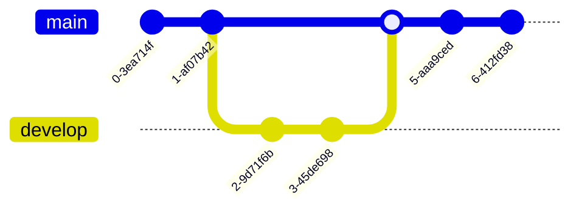

# Test Mermaid Diagrams

This file tests various Mermaid diagram types to ensure they render correctly.

## Flowchart

## Sequence Diagram

## C4 Context Diagram

## Gantt Chart

## State Diagram

## ER Diagram

## Pie Chart

## Class Diagram

## User Journey

## Git Graph

